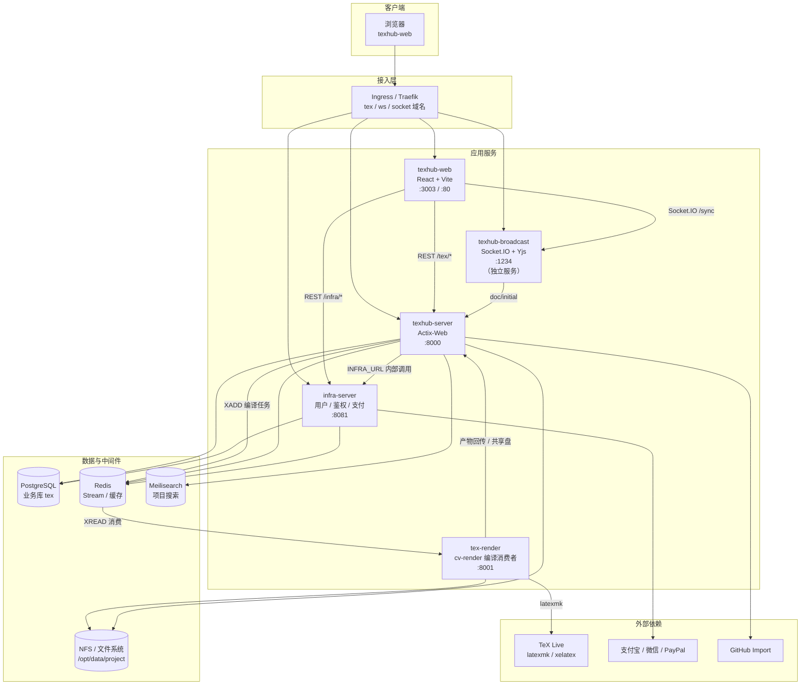
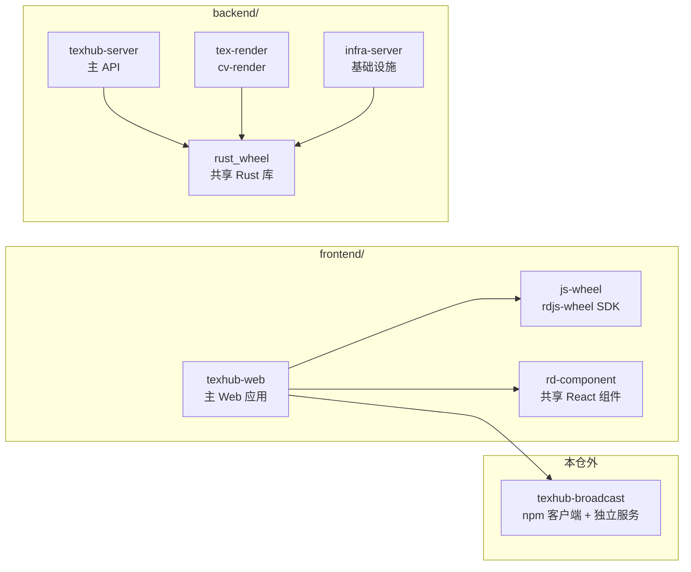
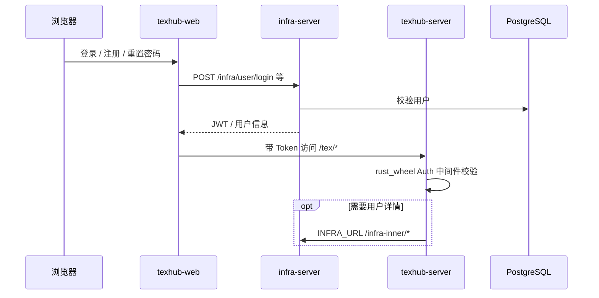
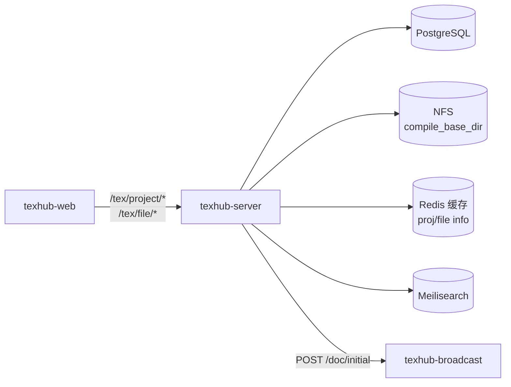
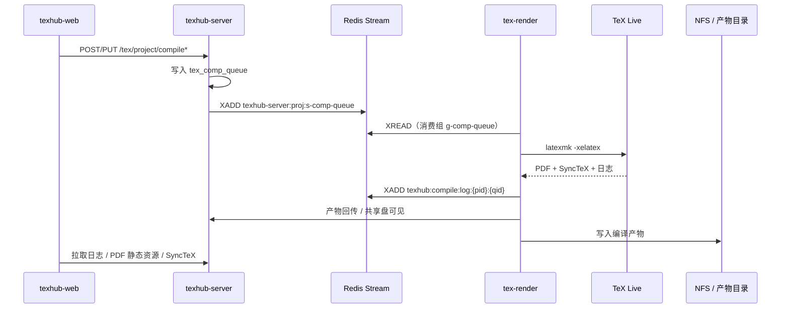
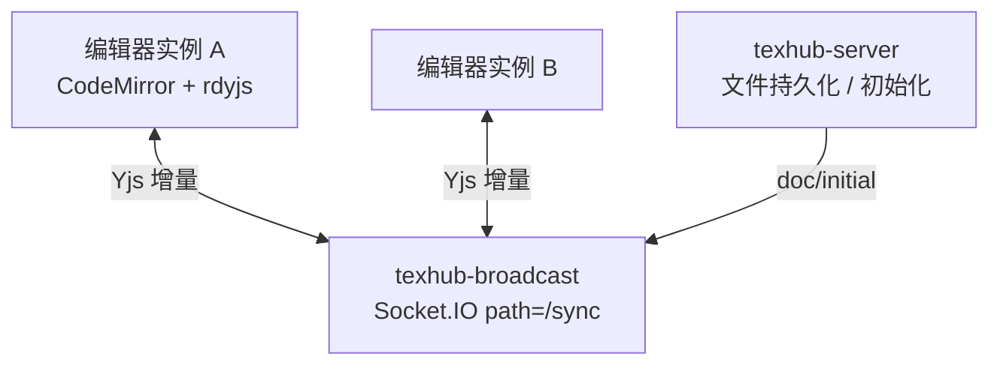
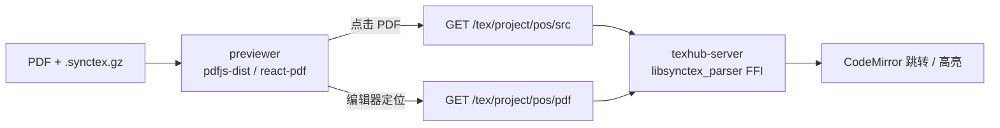
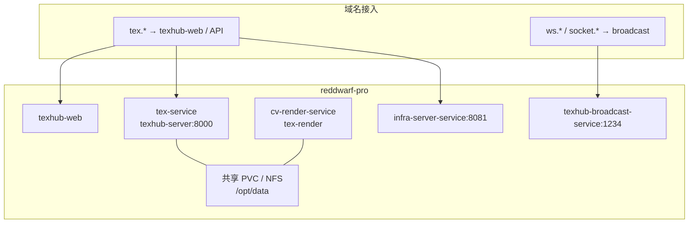

# TexHub 整体架构

TexHub 是在线 LaTeX 协作编辑平台（类 Overleaf），提供多人实时编辑、项目编译、PDF 预览与源码双向定位（SyncTeX）。

本仓库 `texhub-ai` 为 AI 辅助开发工作区，镜像 `dolphin/texhub` 的前后端结构。实时协作服务 **texhub-broadcast** 独立部署，源码不在本 monorepo。

---

## 1. 系统总览

---

## 2. 仓库与组件分层

| 组件 | 路径 / 包名 | 职责 | 默认端口 |
|------|-------------|------|----------|
| texhub-web | `frontend/texhub-web` | 编辑器、PDF 预览、项目管理 | 3003（dev）/ 80（K8s） |
| js-wheel | `frontend/js-wheel`（`rdjs-wheel`） | 鉴权、HTTP、前端模型 | — |
| rd-component | `frontend/rd-component` | 登录/支付/用户等共享 UI | — |
| texhub-server | `backend/texhub-server` | 项目/文件/模板/编译队列/SyncTeX | 8000 |
| tex-render | `backend/tex-render`（`cv-render`） | 消费编译任务，执行 LaTeX | 8001 |
| infra-server | `backend/infra-server` | 用户、鉴权、支付 | 8081 |
| rust_wheel | `backend/rust_wheel` | 配置、鉴权中间件、通用模型 | — |
| texhub-broadcast | 独立部署 | Yjs 实时协作（Socket.IO） | 1234 |

---

## 3. 关键业务链路

### 3.1 鉴权与用户

- 登录、注册、改密、当前用户、Token 刷新走 **infra-server**（`/infra/user/*`、`/infra/auth/*`）。
- 业务 API（`/tex/*`）由 **texhub-server** 用 JWT 鉴权；必要时经内部接口回调 infra。

### 3.2 项目与文件

- 项目元数据与队列状态存 PostgreSQL；源码与编译产物落盘到共享目录（生产多为 NFS `/opt/data`）。
- 创建/初始化文档时可通知 broadcast 初始化 Yjs 文档。

### 3.3 编译流水线

| 配置项 | 典型值 |
|--------|--------|
| 编译任务 Stream | `texhub-server:proj:s-comp-queue` |
| 消费组 | `g-comp-queue` |
| 编译日志 Stream | `texhub:compile:log:{project_id}:{qid}` |
| 项目工作目录 | `compile_base_dir`（如 `/opt/data/project`） |

### 3.4 实时协作

- 文档模型：Yjs（`rdyjs`）；传输：Socket.IO（客户端包 `texhub-broadcast`）。
- 可同步扩展名由服务端配置（如 `tex,cls,bib,...`）。
- 编译进度走 REST / SSE / 轮询，与 Yjs 主路径分离。

### 3.5 PDF 预览与 SyncTeX

坐标约定：后端 SyncTeX box（pt）→ 前端 viewport 像素，需统一 `scale = viewportWidth / pageWidth`。

---

## 4. 技术栈

| 层级 | 技术 |
|------|------|
| 前端框架 | React 18、Vite 7、TypeScript 5 |
| 状态管理 | Redux Toolkit |
| UI | Ant Design 6、Bootstrap 5 |
| 编辑器 | CodeMirror 6（Overleaf fork） |
| PDF | pdfjs-dist 5.x、react-pdf、SyncTeX |
| 实时协作 | texhub-broadcast、Socket.IO、Yjs |
| 后端 | Actix-Web 4、Tokio |
| ORM | Diesel |
| 数据库 | PostgreSQL |
| 队列 / 缓存 | Redis Stream |
| 搜索 | Meilisearch |
| 日志 | log4rs + log |
| 国际化 | i18next（前端）、rust_i18n（后端） |
| 编译环境 | TeX Live、latexmk、XeLaTeX |

---

## 5. 部署拓扑（概要）

生产常见命名空间：`reddwarf-pro`（应用）、`reddwarf-storage`（PG/存储）、`reddwarf-toolbox`（Meilisearch）。

详细部署清单见各服务 `docs/deploy/`；PostgreSQL 备份见 [`docs/ops/backup/`](../ops/backup/README.md)。

---

## 6. 服务交互速查

| 调用方 | 被调用方 | 协议 / 机制 | 用途 |
|--------|----------|-------------|------|
| texhub-web | texhub-server | REST `/tex/*` | 项目、文件、编译、SyncTeX |
| texhub-web | infra-server | REST `/infra/*` | 登录、注册、支付 |
| texhub-web | texhub-broadcast | Socket.IO `/sync` | 协同编辑 |
| texhub-server | infra-server | 内部 HTTP | 用户详情、ID 生成等 |
| texhub-server | Redis | Stream XADD | 投递编译任务 |
| tex-render | Redis | Stream XREAD | 消费编译任务 / 写日志 |
| tex-render | TeX Live | 本地进程 | latexmk 编译 |
| texhub-server / tex-render | NFS | 文件系统 | 源码与 PDF 产物共享 |

---

## 相关文档

- 根目录约定与开发入口：[AGENTS.md](../../AGENTS.md)
- 前端说明：`frontend/texhub-web/README.md`
- 备份运维：[docs/ops/backup/README.md](../ops/backup/README.md)
