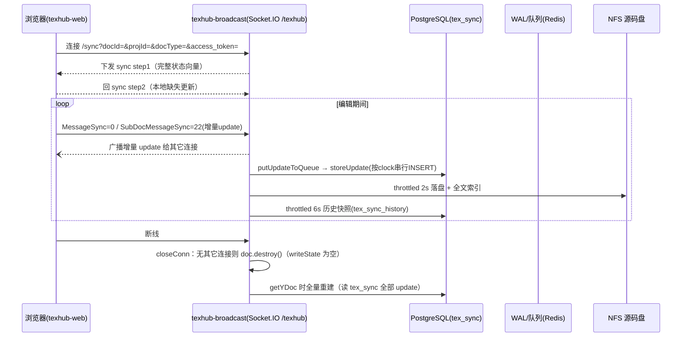

# TeXHub 消息可靠性分析与优化方案

> 范围：实时协作链路（texhub-web ⇄ texhub-broadcast ⇄ PostgreSQL / Redis / NFS）。
> 目标：梳理当前消息同步方式，识别可靠性缺口，给出分优先级、可落地的优化设计。

---

## 1. 结论摘要

当前 Yjs + Socket.IO 协同链路在**在线期间**是收敛正确的（Yjs 状态向量再同步机制可自愈），但存在以下几类确定性风险，优先级从高到低：

| # | 风险 | 优先级 | 一句话说明 |
|---|------|--------|-----------|
| R1 | 客户端无 Outbox，断线/刷新期间本地编辑丢失 | P0 | `broadcastMessage` 在未连接时静默丢弃 |
| R2 | 服务端落库是 fire-and-forget，进程崩溃丢更新 | P0 | `putUpdateToQueue` 入队后不 await，且 `writeState` 为空实现 |
| R3 | 广播进程内 Map，无法水平多副本 | P1 | 无 Socket.IO Redis Adapter，跨实例消息不可达 |
| R4 | 所有发送无 ACK，静默丢包无法感知 | P1 | 无 seq/ack，靠 Yjs 步进对账兜底 |
| R5 | 最后一连接关闭即销毁文档，冷启动 + 抢写竞争 | P2 | `closeConn` 直接 `doc.destroy()`，无延迟销毁/写档收尾 |
| R6 | Redis 锁/去重 TTL 导致的竞争窗口 | P2 | 30s 锁 + 30s hash 去重，极端下有重复或跳写风险 |

**本文 5~9 章给出 P0/P1/P2 的分层设计与里程碑排期。**

---

## 2. 现状梳理

### 2.1 端到端消息链路



要点：

- **文档模型**：Project 为根 Y.Doc（subdoc 容器），每个 tex/cls/bib 文件是一个 subdoc（Yjs Subdocuments），通过单条 Socket.IO 连接复用传输（`SyncMessageType.SubDocMessageSync=22`）。
- **消息类型**：`MessageSync=0`、`MessageAwareness=1`、`MessageControl=21`、`SubDocMessageSync=22`（`model/texhub/sync_msg_type.ts`）。
- **连接策略**：客户端设 `reconnection: false`，由前端自维护指数退避重连（5s→60s+抖动）并主动刷 token（`CollarEditorSocketIOService.ts:50-171`）。子文档模式先发 `probe` 探活再批量 sync step1（`subdoc_connect_handler.ts`）。
- **持久化**：每次 Yjs update → `storeUpdate`（`postgresql_operation.ts:217`）在 Redis 分布式锁内按 `clock` 串行 INSERT 到 `tex_sync`；`getYDoc` 全量读出重建（`postgresql_persistance.ts:60`）。
- **去重/幂等**：`checkAndMarkUpdateHash`（sha256，30s TTL Redis，`redis_util.ts:91`）；每文档 Redis 锁 `lock:{docName}:update`（30s TTL，15 次退避重试）。
- **编译前一致性**：`texhub-server` 编译前调用 `/doc/flush/project`，broadcast 自行挑选"内存挂起池 ∪ Redis 挂起标记"文件强制落盘（`appfile.ts:183` `flushProjectToDisk`），并支持 `waitDocUpdateStable` 等待落库稳态。
- **历史快照**：per-file 6s 节流 + Redis pending 标记 + 冷启动 fallback 重建（`throttle_util.ts`）。

### 2.2 各层可靠性现状

| 层 | 机制 | 是否可靠 |
|----|------|----------|
| 传输(Socket.IO) | TCP + Ping/Pong；无消息 ACK | 在线可靠；断线无 Outbox |
| 应用(Yjs) | 连接期 step1/step2 状态对账；重连后重发 step1 | 对账收敛正确 |
| 落库(PG) | 每 update 一行 tex_sync，per-doc 串行写 | 有崩溃窗口（见 R2） |
| 落盘(NFS) | 2s throttle + 编译前强制 flush | 有，但缺少累计进度校验 |
| 历史(PG) | 6s 快照节流 + 快照/增量链 | 有，链完整性待校验 |
| 多副本 | 无（进程内 Map 广播） | 单副本部署才正确 |

---

## 3. 可靠性风险详析

### R1 客户端无 Outbox（P0）

`SocketIOClientProvider.updateHandler`（`socket_io_client_provider.ts:173-180`）→ `broadcastMessage`（`ws_action.ts:58-69`）：

```ts
export const broadcastMessage = (provider, buf) => {
  if (provider.wsconnected && ws && ws.connected) ws.send(buf); // 未连上则静默丢弃
  if (provider.bcconnected) bc.publish(...);
};
```

场景：
1. 断线期间继续输入 → update 只进内存本地 Y.Doc；
2. 用户断线中刷新/关闭标签页 → 内存丢失；
3. 即使不刷新，重连后依赖 step1/step2 对账，但若服务端进程在此期间重启且 PG 没写到这条（R2 叠加），则该编辑永久丢失。

> 影响：用户最后几秒到几分钟的输入在弱网/断线/崩溃场景下丢失，是最直接的可靠性投诉来源。

### R2 服务端落库 fire-and-forget + 空 writeState（P0）

两处叠加：

1. `putUpdateToQueue`（`postgresql_persistance.ts:148-191`）：
   ```ts
   (async () => { await cacheQueue.add(async () => { await storeUpdate(...); }); })();
   ```
   入队后立即返回，不返回/不等待 Promise。队列是**进程内 PQueue**：
   - 写入 PG 的耗时落在队列缓冲，进程崩溃 → 队列随进程蒸发；
   - `storeUpdate` 内部失败仅打日志，不会重试或补偿。

2. `closeConn`（`ws_action.ts:117-125`）在最后一个连接关闭时执行：
   ```ts
   persistencePostgresql.writeState(doc.name, doc).then(() => { doc.destroy(); });
   ```
   `writeState` 是空实现（`storage.ts:60`），即**不等队列排空、不写档、直接销毁内存文档**。若队列里还有未落库 update，销毁后无法恢复；下次 `getYDoc` 只能从 PG 重建出旧内容。

### R3 广播进程内 Map，无法多副本（P1）

`docs`（`yjs_utils.ts:26`）、`subdocsMap`（`subdoc_msg_handler.ts:37`）、`conns`（`WSSharedDoc.conns`）全部是单进程内存结构。未引入 `@socket.io/redis-adapter`，Socket.IO 广播默认仅限单实例。当前落库/落盘已用 Redis 标记做跨实例（`markDiskFlushPendingRedis`、`markHistoryPending`），推测生产有弹性副本诉求；一旦 broadcast 扩容，**连接到不同副本的客户端无法互见**，协同直接错乱。

### R4 无 ACK 确认（P1）

所有 `send/sendPure/broadcastMessage` 都是 fire-and-forget，无消息序号、无回执。Yjs 状态向量能兜底"我少了哪些"（重连时对账），但：
- 断线前未送达的增量无法自动重放（依赖的连接仍在时不会触发 step1 重发）；
- 长期在线但不活跃的慢连接，若服务端重启，客户端 `_synced` 状态可能残留，且 `_checkInterval` 被注释掉（`socket_io_client_provider.ts:223-234`），**僵尸连接不会被主动发现**。

### R5 文档生命周期粗暴（P2）

无延迟销毁、无优雅收尾：
- 快速开关文档造成反复的 getYDoc 全量重建（读空/删空 `tex_sync`），冷启动放大；
- 多文件项目每次切文件都走 subdoc step1/step2，占用带宽。

### R6 锁/去重 TTL 竞争（P2）

- 分布式锁 30s TTL：若 `storeUpdate` 内的 PG 写 + getYDoc 重建超过 30s（大文档），锁被顶替 → 两个实例并发写同一 clock → `tex_sync` 出现重复 key（虽有 hash 去重，但去重本身 30s 窗口外不生效）。
- `flushDocument` 的 `clearUpdatesRange` "intentionally not waiting"，trim 与并发写存在竞态。

---

## 4. 设计原则

1. **永不依赖进程内内存来做唯一事实源**：更新先落地到共享中间件，再进 PG/FS。
2. **消息确认与重放分层**：传输层 ACK 保证"送达"，Outbox 保证"未送达不丢"，Yjs 状态向量兜底"状态一致"。
3. **幂等为主**：所有落库路径以 update hash / clock 幂等，允许重放。
4. **不改变 Yjs 协议**：保留现有 MessageSync / SubDocMessageSync 消息格式，可靠性增强在传输与持久化外围叠加，避免编辑器/协议层回归。
5. **渐进上线**：P0（数据丢失）→ P1（可用性/多副本）→ P2（体验/治理），每步独立可回滚。

---

## 5. P0 优化：落库 WAL + 客户端 Outbox

### 5.1 服务端：Redis Stream 预写日志（WAL）

将"每 update 直接串行 INSERT"改为"先写 WAL，再异步批量落库"。

```mermaid
flowchart LR
  BC[handleYDocUpdate] -->|XADD| WAL[(Redis Stream<br/>texhub:sync:updates:{docName})]
  WAL -->|XREADGROUP g-sync-updates| WK[WAL Worker]
  WK -->|XACK| WAL
  WK -->|批量幂等INSERT| PG[(tex_sync)]
  WK -->|trim后的兜底| FS[NFS 源码盘]
```

要点：
- **Stream 命名**：`texhub:sync:updates:{docName}`，消费组 `g-sync-updates`，不带取消确认（`XADD` 即持久在网络 Redis，进程崩溃后可重放）。
- **Worker 幂等消费**：消息体带 `updateHash + clock + docName`；Worker 消费时先 `checkAndMarkUpdateHash` 再 INSERT（沿用现有去重），`XACK` 在 INSERT 成功后执行。重复消费安全。
- **批量合并**：单文档在同一消费周期内多条 update 可先 `Y.mergeUpdates` 再单条写，减少 PG 写入量（与现有 `PREFERRED_TRIM_SIZE` 逻辑兼容）。
- **移除 fire-and-forget**：`handleYDocUpdate` 改为 `await XADD`（命令级确认），彻底消除"入队后进程崩溃"窗口。
- **`putUpdateToQueue` 退出主链路**：其"进程内 PQueue + fire-and-forget"的排队职责整体由 WAL 顶替；真正写 `tex_sync` 的 `storeUpdate` / `pgPut`（`postgresql_operation.ts:217`）**保留并由 WAL Worker 复用**（幂等消费内部仍走 `checkAndMarkUpdateHash` → 锁内按 clock INSERT）。
- **守卫迁移**：`putUpdateToQueue` 中两个守卫必须在新路径保留——① `docType === PROJECT` 跳过（项目根 doc 不落库）；② `getTexFileInfo` 富化 `docShowName`（XADD 时前置，或 Worker 内补）。串序不再依赖 PQueue 的 `concurrency:1`，改由 Stream 有序追加 + `storeUpdate` 既有跨实例分布式锁保证（锁本就在，去掉 PQueue 不引入新的并发风险）。
- **保留 per-doc 不乱序**：Yjs update 本身有序应用才正确 → Worker 对同一 doc 用单消费者串行（Redis Stream 按 docName 分片，或 Worker 内按 docName 分桶 PQueue）。

> 兼容性：WAL 只替换"从内存→PG"这一段，Yjs 广播与 Socket.IO 消息格式不变；Worker 失败时 Stream 保持 pending，可在恢复后重放，即天然补偿。

### 5.2 客户端：Outbox（IndexedDB）+ ACK 回执

目标：断线/刷新/崩溃不丢本地编辑。

- **本地队列**：浏览器 IndexedDB（`texhub:outbox:{projectId}`），按 docName + 单调 seq 追加 Yjs update 二进制。
- **发送路径改造**：`provider.updateHandler` 产生 update 时：
  1. 写入 Outbox（内存缓冲 + IndexedDB 持久化）；
  2. `wsconnected` 时发送，并记录未确认 seq；
  3. 收到服务端 ACK 后删除对应 seq。
- **重连恢复**：`connect` 事件触发时——先重放 Outbox 中未确认 update（保证服务端是最新），再发 sync step1（对账收敛）。两者幂等，安全。
- **ACK 通道**：为不破坏 Yjs 协议，ACK 走独立的 Socket.IO 事件（如 `socket.emit("sync:ack", { seq, doc })` / 服务端 `socket.on("sync:ack_req", cb)`），与 `message` 二进制通道解耦；服务端在 `readSyncMessage` 应用 update 成功后回 ACK。若不需要改协议，也可在 `MessageSync` 后追加一个 `SyncMessageType.MessageAck`（不推荐污染 Yjs 帧，优先独立事件）。

### 5.3 ACK/Outbox 协议（建议）——独立事件通道

| 事件 | 方向 | 载荷 | 语义 |
|------|------|------|------|
| `sync:ack` | 服务端→客户端 | `{ doc, seq }` | 服务端已把该 seq update 应用进内存 doc |
| `sync:persist` | 服务端→客户端 | `{ doc, seq }` | 服务端确认已写入 WAL（强一致选项） |
| `sync:flush` | 服务端→客户端 | `{ doc, clock }` | 编译前 flush 完成（可叠加现有 /doc/flush/project） |

客户端仅在收到 `sync:ack`（或 `sync:persist`）后从 Outbox 删除。断线时 Outbox 保留，重连重放。

> 选择 `ack`（内存应用即确认）还是 `persist`（WAL 落盘确认）取决于体验/安全的折中：
> 默认建议 `ack`（低延迟）；`sync:persist` 作为"编译前 / 关闭页面前"的强一致收尾。

---

## 6. P1 优化：多副本广播 + 僵尸连接治理

### 6.1 Socket.IO Redis Adapter

- 引入 `@socket.io/redis-adapter`，用现有 ioredis 实例创建广播 pub/sub（`texhub:sync:pubsub`）。
- 服务端 `updateHandler`/`serverWriteUpdate` 不再直接遍历 `{rootDoc}.conns`，而是走 `io.of("/texhub").to(room).emit`（room = docName），由 Adapter 跨实例转发。进程内 `conns` 收敛为连接管理 + ACK 记录。
- 同步变更点：
  - `ws_share_doc.ts` updateHandler → 改为适配器广播 + 本实例直连优化；
  - `subdoc_msg_handler.ts` `serverWriteUpdate` 同样改为 room 广播（对 `subdocsMap` 本实例缓存做直连快路径，避免同实例经过 Redis 环回）。
- 注意：子文档消息未经 y-protocols 的 room 概念，需要为每个 docName 单独 `socket.join(docName)` 后再复用现有消息封装。

### 6.2 僵尸连接与心跳

- 启用 `_checkInterval`：超过阈值（默认 30s，可配）无任何消息（包括 awareness 心跳）的客户端主动 `ws.close()`，触发前端既有的指数退避重连；同时不再静默（记录 drop/reconnect 指标）。
- 支持 Socket.IO connection state recovery（v4.6+，`connectionStateRecovery`）进一步缓解短暂断线重发开销。

### 6.3 会话一致性

- AE（Server）在 `connect` 握手时下发 `serverEpoch`（进程启动时间/版本号）。
- 客户端本地缓存 `serverEpoch`；重连发现 epoch 变化即认为"服务端曾重启"，主动重建 provider 完整对账（发 step1 + 重放 Outbox），避免 `_synced` 残留误判。

---

## 7. P2 优化：文档生命周期与存储收尾

### 7.1 延迟销毁 + 优雅落库

- `closeConn` 不再立即 `doc.destroy()`：
  1. 将文档移入"空窗缓存"（LRU，TTL 默认 60s，可配）；
  2. 等待该文档的 WAL 队列排空（`XTRIM` 后 `XINFO GROUPS pending=0`，或 Worker 返回 `waitDocUpdateStable` true）；
  3. 空窗内再次连接则直接复用内存 doc（大幅降低冷启动重建）；
  4. 空窗到期且无连接再 destroy + 写档收尾。
- `Persistence.writeState` 落真正实现：至少保证 WAL 落盘完成；可选将内存 doc 状态快照写 `tex_sync` 一条 compact update（配合 GC 后可降低重建成本）。

### 7.2 全量重建优化

- `getYDoc` 目前遍历全部 update：改为"最近快照 + 快照后增量"两条查询（复用 `tex_sync_history` 中"snapshot"），长文档重建从 O(N) update 降为 1 次快照应用 + 少量增量。

### 7.3 锁/去重竞争治理

- 锁 TTL 从固定 30s 改为按文档规模估算（小文档 10s，大文档 60s），并加 Lua 续期（watchdog），避免大文档写超时被顶替。
- `flushDocument` 的 `clearUpdatesRange` 改为按 `clock <= 已确认水位`（WAL 确认位置）删除，消除 trim 与写入竞态。
- 去重 hash 的 Redis key 增加随机扰动校验 `updateHash + clock`，避免"同内容不同 clock"被误跳。

---

## 8. 可观测性与一致性校验

### 8.1 文档时钟校验接口

- 新增 `GET /doc/health/{docName}`（broadcast 内部）返回：
  ```json
  { "docName": "...", "clock": 1234, "walPending": 0,
    "diskClock": 1200, "memoryConns": 5, "svHash": "..." }
  ```
- 前端在打开文档/重连成功后比对 `editor content checksum` 与示 server `svHash`；不一致触发一次强制 re-sync（`forceSetCurSubDoc` + step1 重发），作为 ACK 之外的兜底对账。

### 8.2 编译前强一致

- `texhub-server` 编译前调用 `/doc/flush/project` 需返回**逐文件最终 clock**；texhub-server 记录该 clock 并与编译快照绑定，编译日志/产物按该基线生成，避免"编译的是半个文档"的隐性不一致。

### 8.3 Metrics

在 `controllers/profile/metrics_controller.ts`（prom-client）追加：

| 指标 | 含义 |
|------|------|
| `texhub_sync_update_dropped_total` | Outbox/未连接丢弃数（应趋 0） |
| `texhub_sync_ack_latency_ms` / `persist_latency_ms` | ACK / 落库延迟 |
| `texhub_sync_wal_pending{doc}` | WAL 未确认积压 |
| `texhub_sync_reconnect_total` / `reconnect_backoff_max` | 重连计数与退避上限 |
| `texhub_sync_doc_destroyed_total` | 文档生命周期事件 |

### 8.4 日志链路

- 复用现有 `trace_id`（`SyncMessageContext.trace_id`），在 Outbox/ACK/WAL 每跳追加阶段日志；断线重放日志可串起整条丢失与恢复链路。

---

## 9. 里程碑与验证

| 里程碑 | 内容 | 主要改动点 | 验证 |
|--------|------|-----------|------|
| **M1** | 落库 WAL（Redis Stream）+ Worker 幂等消费，修复 R2 | `postgresql_persistance`、新增 WAL worker；`storage.ts writeState` 落地；`closeConn` 收尾 | 进程 kill -9 场景：客户端不刷新时重连对账不丢；PG 行数与 WAL 消费一致；`XINFO GROUPS pending` 长期为 0 |
| **M2** | 客户端 Outbox + ACK 重放，修复 R1/R4 | `texhub-web` 侧 IndexedDB Outbox + ack 监听；broadcast 增 `sync:ack` 事件 | 断线状态下输入→断线中刷新页面→重连后内容完整；Chrome DevTools offline 模拟 |
| **M3** | 多副本广播 + 僵尸连接治理，修复 R3 | `@socket.io/redis-adapter`、room 化广播、`_checkInterval` 启用、`serverEpoch` | 2 副本部署：A 副本客户端编辑，B 副本客户端秒级可见；kill A 副本，B 侧无残留 |
| **M4** | 可观测性 + 一致性校验 + 生命周期治理，落地 R5/R6 | 时钟校验接口、metrics、延迟销毁、锁 watchdog | 文档时钟/全量重建耗时下降；改造前 vs 后 metrics 对比；回归 `pnpm build` + `cargo build` 相关服务 |

**回归清单（每个里程碑）：**
- 前端：`cd frontend/texhub-web && pnpm build`（及 `pnpm test` 如启用）
- broadcast：`cd backend/texhub-broadcast && npm run build`
- 后端：`cd backend/texhub-server && cargo build`
- 手工：单用户快速切换文件、双用户并发编辑、断线 30s 内重连、断线中刷新、编译前裸 flush。

---

## 10. 关联文档

- 架构总览：[`architecture.md`](./architecture.md)
- 根目录约定：[`AGENTS.md`](../../AGENTS.md)
- 广播源码参考（本仓镜像）：`backend/texhub-broadcast/src/`
  - 客户端连接/重连：`frontend/texhub-web/src/service/editor/CollarEditorSocketIOService.ts`
  - 消息分发：`backend/texhub-broadcast/src/websocket/conn/action/ws_action.ts`
  - 落库队列：`backend/texhub-broadcast/src/storage/adapter/postgresql/postgresql_persistance.ts`
  - 文档生命周期：`backend/texhub-broadcast/src/websocket/conn/action/ws_action.ts`（`closeConn`）