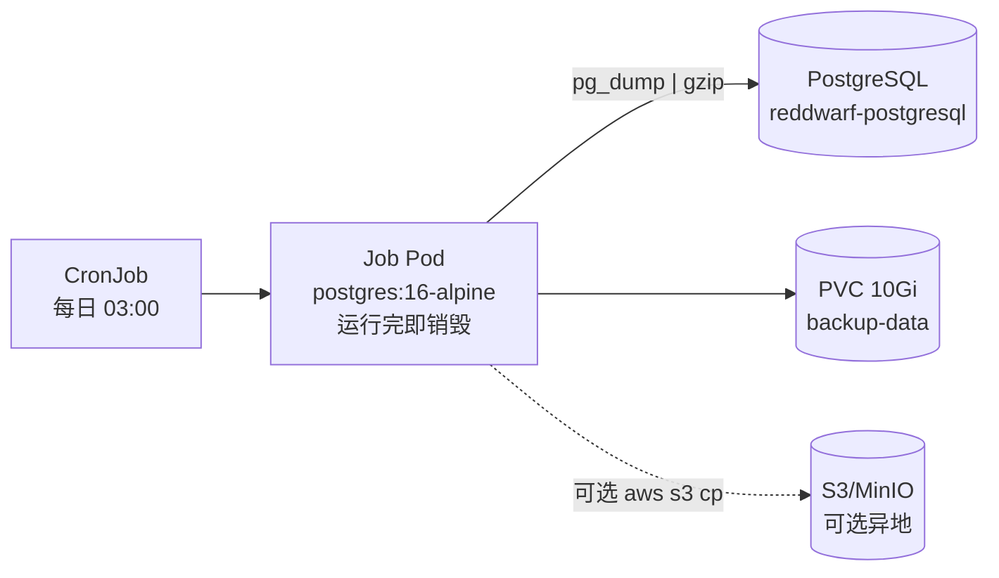

# PostgreSQL 轻量级备份方案（pg_dump + CronJob）

适用于 **无 Operator、资源紧张** 的 Kubernetes 集群。不部署 pgBackRest Sidecar、不启用 WAL 归档、不常驻备份 Pod，仅在 CronJob 触发时短暂拉起备份容器。

> 完整 pgBackRest 方案见 [postgresql-pgbackrest-backup-plan.md](./postgresql-pgbackrest-backup-plan.md)，适用于资源充足且需要 PITR 的场景。

---

## 1. 方案对比

| 维度 | 轻量方案（本文） | pgBackRest 方案 |
|------|------------------|-----------------|
| 额外常驻 Pod | **0** | 1+（repo host / sidecar） |
| 单次 Job 内存 | **128–256 MiB** | 512 MiB–2 GiB |
| 备份类型 | 逻辑全量（pg_dump） | 物理全量 + 增量 + WAL |
| PITR | **不支持** | 支持 |
| RPO | **≤ 24h**（按 Cron 频率） | ≤ 15 min |
| 实现复杂度 | 低 | 中高 |
| 适用库规模 | **< 50 GB** | 任意 |

TexHub 主库 `tex` 在无 Operator 的开发/小规模部署中，通常属于轻量方案覆盖范围。

---

## 2. 架构



**设计原则：**

1. **按需运行**：CronJob 触发时才创建 Pod，完成后销毁，无额外常驻开销
2. **最小镜像**：`postgres:16-alpine`（~80 MB），自带 `pg_dump` / `psql`
3. **单 CronJob**：每日一次全库逻辑备份，不做 diff/incr 拆分
4. **本地保留 + 可选上传**：PVC 保留 7 天；若空间紧张，上传 S3 后删除本地副本

---

## 3. 资源预算

### 3.1 集群额外占用（稳态）

| 资源 | 占用 |
|------|------|
| Pod（常驻） | **0** |
| PVC | 10–20 Gi（可调） |
| CronJob 对象 | 可忽略 |

### 3.2 单次备份 Job 峰值

| 资源 | requests | limits | 说明 |
|------|----------|--------|------|
| CPU | 50m | 500m | dump 期间短时升高 |
| Memory | 128Mi | 256Mi | 小库足够；>10GB 库可提到 512Mi |

> pg_dump 内存与单表大小相关，非整库大小。TexHub 常规表结构下 256Mi limit 通常够用；若 OOM，优先升 limit 而非加 Sidecar。

### 3.3 PVC 容量估算

```
PVC 大小 ≈ 压缩后备份大小 × 保留天数 × 1.2（余量）

示例：库 2GB，压缩率 5:1 → 单份 ~400MB
      保留 7 天 → 400MB × 7 ≈ 2.8GB → 建议 PVC 10Gi
```

---

## 4. 备份策略

| 项 | 配置 |
|----|------|
| 频率 | 每日 03:00（`0 3 * * *`，`Asia/Shanghai`） |
| 方式 | `pg_dump -Fc` 自定义格式 **或** `pg_dump \| gzip` 纯 SQL |
| 保留 | PVC 本地 7 天（`find -mtime +7 -delete`） |
| 异地 | 可选：Job 末尾 `aws s3 cp` / `mc cp`，本地只留 1 份 |
| 结构备份 | 可选：每周日额外 `--schema-only`（体积极小） |

**格式选择：**

| 格式 | 命令 | 优点 | 缺点 |
|------|------|------|------|
| 自定义（推荐） | `pg_dump -Fc` | 支持并行 restore、`pg_restore -j` | 需 pg_restore 恢复 |
| 纯 SQL + gzip | `pg_dump \| gzip` | 可读、通用 | 大库 restore 慢 |

---

## 5. 部署

### 5.1 前置条件

- PostgreSQL 已通过 StatefulSet / Helm / 裸 Pod 部署，集群内 Service 可达
- 备份用数据库账号具备 `SELECT` 及 dump 所需权限（`postgres` 或专用 `backup` 角色）
- 创建备份 PVC 与 Secret

### 5.2 创建 Secret

```bash
kubectl -n reddwarf-storage create secret generic postgres-backup-creds \
  --from-literal=POSTGRES_USER=postgres \
  --from-literal=POSTGRES_PASSWORD='<password>' \
  --from-literal=POSTGRES_DB=tex
```

### 5.3 应用 Manifest

```bash
kubectl apply -f docs/ops/backup/manifests/backup-cronjob-pgdump.yaml
```

### 5.4 手动试跑

```bash
kubectl -n reddwarf-storage create job --from=cronjob/postgres-pgdump-backup postgres-pgdump-backup-manual-$(date +%s)
kubectl -n reddwarf-storage logs -l job-name=postgres-pgdump-backup-manual-* -f
```

### 5.5 验证

```bash
# 查看 Job 状态
kubectl -n reddwarf-storage get jobs -l app=postgres-pgdump-backup

# 进入临时 Pod 列出备份文件（或 exec 到 Job 完成前的 Pod）
kubectl -n reddwarf-storage run -it --rm debug --image=postgres:16-alpine --restart=Never -- \
  sh -c "ls -lh /backup"
# 需挂载同一 PVC，仅用于调试
```

---

## 6. 恢复

### 6.1 自定义格式（-Fc）

```bash
# 解压/拷贝备份到可访问位置
BACKUP=/backup/tex_20260714_030001.dump

# 恢复到空库（--clean 会先 drop 对象，慎用生产）
pg_restore -h reddwarf-postgresql.reddwarf-storage.svc.cluster.local \
  -U postgres -d tex --clean --if-exists -j 2 "$BACKUP"
```

### 6.2 纯 SQL + gzip

```bash
gunzip -c /backup/tex_20260714_030001.sql.gz | \
  psql -h reddwarf-postgresql.reddwarf-storage.svc.cluster.local \
       -U postgres -d tex
```

### 6.3 在集群内恢复 Job 模板

见 [manifests/backup-restore-job-pgdump.yaml](./manifests/backup-restore-job-pgdump.yaml)（仅用于演练命名空间）。

### 6.4 恢复验证

```sql
SELECT count(*) FROM information_schema.tables WHERE table_schema = 'public';
-- 抽样关键业务表行数
```

---

## 7. 可选：S3 异地（不增加常驻 Pod）

在 CronJob 脚本末尾追加（需 Job 镜像换为带 aws-cli 的轻量镜像，或使用 init 容器拷贝）：

```bash
# 上传最新备份
aws s3 cp "${BACKUP_FILE}" "s3://${S3_BUCKET}/postgres/${DB_NAME}/$(basename ${BACKUP_FILE})"

# 本地只保留最近 2 份，其余删除以节省 PVC
ls -1t "${BACKUP_DIR}"/*.dump 2>/dev/null | tail -n +3 | xargs -r rm -f
```

S3 凭证通过 Secret 注入 `AWS_ACCESS_KEY_ID` / `AWS_SECRET_ACCESS_KEY`，Endpoint 指向 MinIO 时加 `AWS_ENDPOINT_URL`.

此方式可将 PVC 缩至 **5Gi**，主要存储仍在对象存储。

---

## 8. 监控（最小集）

| 检查 | 方式 | 告警 |
|------|------|------|
| Job 成功 | `kube_job_status_succeeded` | 24h 内无成功 |
| Job 失败 | `kube_job_status_failed` | 连续 2 次 |
| PVC 使用率 | kubelet volume stats | > 85% |
| 备份文件存在 | 可选：Job 末尾 `curl` 上报 | — |

无需 postgres_exporter 额外指标；CronJob + PVC 监控即可。

---

## 9. 限制与升级路径

### 9.1 已知限制

- **无 PITR**：只能恢复到最近一次 dump 完成时刻
- **大表锁**：`pg_dump` 对超大表可能持锁较久；业务低峰执行
- **逻辑备份**：restore 慢于物理备份；库 > 50GB 建议迁移到 pgBackRest

### 9.2 何时升级到 pgBackRest

- 数据库超过 50GB 或 dump 窗口超过 1 小时
- 业务要求 RPO < 1 小时
- 集群资源扩容后可接受 Sidecar / repo Pod

升级路径见 [postgresql-pgbackrest-backup-plan.md](./postgresql-pgbackrest-backup-plan.md) §3.2。

---

## 10. 实施 Checklist

- [ ] 确认 PG Service 地址与版本（manifest 中 `postgres:16-alpine` 需匹配）
- [ ] 创建 `postgres-backup-creds` Secret
- [ ] 创建 10Gi PVC（`backup-data-pvc`）
- [ ] `kubectl apply` CronJob manifest
- [ ] 手动触发 Job 并确认 `/backup` 下生成文件
- [ ] 在测试命名空间做一次 restore 演练
- [ ] 配置 Job 失败告警（可选）

---

## 11. 参考

- 脚本原型：`backend/texhub-server/docs/db/backup/backup.sh`
- [Kubernetes CronJob](https://kubernetes.io/docs/concepts/workloads/controllers/cron-jobs/)
- [pg_dump 文档](https://www.postgresql.org/docs/current/app-pgdump.html)
