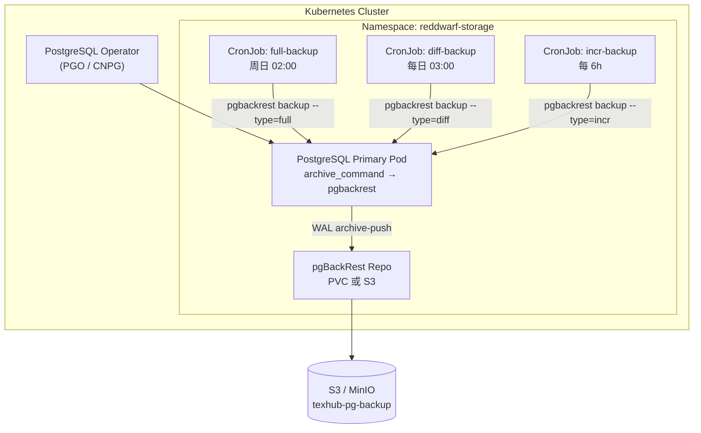

# PostgreSQL Operator 备份方案：pgBackRest + CronJob

## 1. 目标与范围

### 1.1 目标

- 对 Kubernetes 中由 **PostgreSQL Operator** 管理的 PostgreSQL 集群实施 **自动化、可恢复、可审计** 的备份
- 使用 **pgBackRest** 作为备份引擎，支持全量 / 差异 / 增量备份与 **PITR（Point-in-Time Recovery）**
- 通过 **Kubernetes CronJob** 按策略定期触发备份任务
- 备份数据存储于 **独立存储**（S3/MinIO 或专用 PVC），与数据库 PV 解耦

### 1.2 范围

| 纳入 | 不纳入 |
|------|--------|
| TexHub 主库 `tex`（`reddwarf-storage` 命名空间） | 跨 Region 异地复制（可后续扩展） |
| WAL 连续归档 | 应用层数据导出（CSV/逻辑复制） |
| 备份保留与过期清理 | 密钥轮换自动化 |

### 1.3 RPO / RTO 目标（建议值，可按业务调整）

| 指标 | 目标 | 实现手段 |
|------|------|----------|
| **RPO** | ≤ 15 分钟 | WAL 连续归档（`archive-push`） |
| **RTO** | ≤ 2 小时（全库恢复） | pgBackRest 增量链 + 预演 Runbook |
| **备份保留** | 全量 30 天 + WAL 7 天 | pgBackRest `repo-retention-*` |

---

## 2. 架构概览



### 2.1 组件职责

| 组件 | 职责 |
|------|------|
| **PostgreSQL Operator** | 管理集群生命周期；PGO 场景下自动创建 pgBackRest Repo 与 CronJob |
| **pgBackRest** | 物理备份、WAL 归档、校验、恢复 |
| **CronJob** | 按 cron 表达式触发 `pgbackrest backup` Job |
| **Repo 存储** | 存放 backup set 与 WAL；推荐 S3/MinIO，开发环境可用 PVC |
| **Secret** | 存放 S3 凭证、pgBackRest stanza 加密密钥（如启用） |

### 2.2 备份类型策略

pgBackRest 支持三种备份类型，建议组合如下：

| 类型 | 频率 | Cron 示例 | 说明 |
|------|------|-----------|------|
| **full** | 每周 1 次 | `0 2 * * 0` | 完整数据文件快照，恢复基线 |
| **diff** | 每天 1 次 | `0 3 * * 1-6` | 相对上次 full 的变更，平衡空间与速度 |
| **incr** | 每 6 小时 | `0 */6 * * *` | 相对上次任意备份的变更，缩小 RPO 窗口 |

> **注意**：pgBackRest 同一 repo **同时只能运行一个备份**。CronJob 必须设置 `concurrencyPolicy: Forbid`，且 full/diff/incr 调度需错开，避免 Job 堆积失败。

---

## 3. 部署路径

### 3.1 路径 A：Operator 内置 pgBackRest（推荐 — Crunchy PGO）

若集群由 [Crunchy PostgreSQL Operator (PGO)](https://access.crunchydata.com/documentation/postgres-operator/) 管理，pgBackRest 为默认集成方案，Operator **自动创建 CronJob**，无需手写备份 Job。

#### 3.1.1 PostgresCluster 备份配置

在现有 `PostgresCluster` CR 中增加 `spec.backups` 段，完整示例见 [manifests/postgrescluster-backup.yaml](./manifests/postgrescluster-backup.yaml)。

核心配置要点：

```yaml
spec:
  backups:
    pgbackrest:
      repos:
        - name: repo1
          # 方案一：S3/MinIO（生产推荐）
          s3:
            bucket: texhub-pg-backup
            endpoint: minio.reddwarf-storage.svc.cluster.local:9000
            region: us-east-1
          # 方案二：本地 PVC（开发/小规模）
          # volume:
          #   volumeClaimSpec:
          #     accessModes: ["ReadWriteOnce"]
          #     resources:
          #       requests:
          #         storage: 100Gi
          #     storageClassName: local-path
          schedules:
            full: "0 2 * * 0"        # 周日 02:00 UTC+8 请自行换算
            differential: "0 3 * * 1-6"
            incremental: "0 */6 * * *"
          retention:
            type: time
            time: "30d"              # 全量备份保留 30 天
      global:
        repo1-retention-full: "4"    # 至少保留 4 个 full
        repo1-retention-diff: "7"
        archive-async: "y"           # 异步 WAL 归档，降低主库延迟
```

#### 3.1.2 S3 凭证

通过 Secret 注入（PGO 约定 Secret 名称与 key，见 manifest 注释）：

```bash
kubectl -n reddwarf-storage create secret generic pgo-backup-s3-creds \
  --from-literal=repo1-s3-key=<ACCESS_KEY> \
  --from-literal=repo1-s3-key-secret=<SECRET_KEY>
```

#### 3.1.3 验证 Operator 创建的 CronJob

```bash
kubectl -n reddwarf-storage get cronjobs -l postgres-operator.crunchydata.com/cluster=reddwarf-postgresql
kubectl -n reddwarf-storage get jobs -l postgres-operator.crunchydata.com/pgbackrest-backup=true
```

#### 3.1.4 手动触发一次性备份

```bash
kubectl -n reddwarf-storage annotate postgrescluster reddwarf-postgresql \
  postgres-operator.crunchydata.com/pgbackrest-backup="$(date +%s)" --overwrite
```

---

### 3.2 路径 B：独立 pgBackRest CronJob（通用 / 非 PGO）

若使用 Zalando Postgres Operator、自建 StatefulSet，或需在 Operator 之外补充备份，采用 **Sidecar 或独立 Backup Pod + CronJob** 方案。

#### 3.2.1 前置条件

1. PostgreSQL 主库已配置 WAL 归档：

```ini
# postgresql.conf（由 Operator 或 ConfigMap 注入）
archive_mode = on
archive_command = 'pgbackrest --stanza=pod archive-push %p'
wal_level = replica
```

2. pgBackRest 配置文件 `/etc/pgbackrest/pgbackrest.conf`（ConfigMap 挂载）：

```ini
[global]
repo1-path=/pgbackrest/repo
repo1-retention-full=4
repo1-retention-diff=7
log-level-console=info
start-fast=y
delta=y
process-max=4
compress-type=zst

# S3 后端示例
repo1-type=s3
repo1-s3-endpoint=minio.reddwarf-storage.svc.cluster.local:9000
repo1-s3-bucket=texhub-pg-backup
repo1-s3-key=<从 Secret 注入>
repo1-s3-key-secret=<从 Secret 注入>
repo1-s3-region=us-east-1
repo1-s3-uri-style=path

[pod]
pg1-path=/var/lib/postgresql/data
pg1-port=5432
pg1-user=postgres
pg1-socket-path=/var/run/postgresql
```

3. 初始化 stanza（仅需执行一次）：

```bash
kubectl -n reddwarf-storage exec -it <postgres-pod> -c pgbackrest -- \
  pgbackrest --stanza=pod stanza-create
kubectl -n reddwarf-storage exec -it <postgres-pod> -c pgbackrest -- \
  pgbackrest --stanza=pod check
```

#### 3.2.2 CronJob 设计要点

完整 manifest 见 [manifests/backup-cronjob-standalone.yaml](./manifests/backup-cronjob-standalone.yaml)。

| 字段 | 建议值 | 原因 |
|------|--------|------|
| `concurrencyPolicy` | `Forbid` | 防止备份重叠导致 pgBackRest 锁冲突 |
| `startingDeadlineSeconds` | `3600` | 允许错过调度后 1 小时内补跑 |
| `backoffLimit` | `2` | 失败重试上限 |
| `activeDeadlineSeconds` | `7200` | 单 Job 最长 2 小时，防止僵尸 Pod |
| `successfulJobsHistoryLimit` | `3` | 保留最近成功 Job 便于审计 |
| `failedJobsHistoryLimit` | `5` | 保留失败记录便于排障 |

CronJob 容器镜像推荐：`crunchydata/crunchy-pgbackrest:ubi8-2.51-0`（与 PG 大版本匹配）。

#### 3.2.3 三套 CronJob 分工

| CronJob 名称 | Schedule | 命令 |
|--------------|----------|------|
| `pgbackrest-full-backup` | `0 2 * * 0` | `pgbackrest --stanza=pod backup --type=full` |
| `pgbackrest-diff-backup` | `0 3 * * 1-6` | `pgbackrest --stanza=pod backup --type=diff` |
| `pgbackrest-incr-backup` | `0 */6 * * *` | `pgbackrest --stanza=pod backup --type=incr` |

备份完成后执行 `pgbackrest --stanza=pod info` 输出到 stdout，便于日志采集。

---

## 4. 存储方案选型

| 方案 | 适用场景 | 优点 | 缺点 |
|------|----------|------|------|
| **S3 / MinIO** | 生产 | 与节点/PV 解耦、易异地复制、成本低 | 需维护对象存储 |
| **专用 PVC** | 开发 / 单节点 | 配置简单 | 与集群节点绑定，DR 能力弱 |
| **双 Repo** | 高可用 | repo1=S3 + repo2=PVC 本地缓存 | 存储与带宽翻倍 |

**TexHub 生产建议**：MinIO（集群内）或云厂商 S3；开发环境可用 `local-path` PVC，见 [manifests/backup-repo-pvc.yaml](./manifests/backup-repo-pvc.yaml)。

### 4.1 容量估算

```
备份空间 ≈ 全量大小 × 保留 full 份数
         + 每日 diff 增量 × 保留天数
         + WAL 归档（日均 WAL 量 × 保留天数）

示例：数据库 50GB，每日变更 5GB，WAL 10GB/天
  full(4)  = 200GB
  diff(7)  ≈ 35GB
  WAL(7)   ≈ 70GB
  合计     ≈ 305GB → 建议预留 400GB
```

---

## 5. 保留与过期策略

### 5.1 pgBackRest 保留参数

```ini
repo1-retention-full=4      # 保留最近 4 次 full
repo1-retention-diff=7      # 每个 full 周期内保留 7 次 diff
repo1-retention-archive-type=full  # WAL 归档保留与 full 对齐
repo1-retention-archive=7   # WAL 文件保留天数
```

### 5.2 与 Cron 策略的对应关系

| 备份频率 | retention-full=4 | 实际覆盖 |
|----------|------------------|----------|
| 每周 full | 4 | ~4 周历史 |

过期清理由 pgBackRest 在每次 backup 后自动执行 `expire`；无需额外 CronJob 清理。

---

## 6. 安全

| 项 | 要求 |
|----|------|
| S3 凭证 | 仅存于 Kubernetes Secret，RBAC 限制 `get secret` |
| 备份加密 | 启用 `repo1-cipher-type=aes-256-cbc` + `repo1-cipher-pass`（Secret 注入） |
| 网络 | Backup Job 仅访问集群内 PG Service 与 MinIO，不暴露公网 |
| 审计 | CronJob / Job 事件写入集群日志；S3 开启访问日志 |

---

## 7. 监控与告警

### 7.1 必监控指标

| 检查项 | 方式 | 告警条件 |
|--------|------|----------|
| 最近 full 备份时间 | `pgbackrest info --output=json` | 超过 8 天未 full |
| 最近任意备份 | CronJob `lastScheduleTime` | 超过 24h 无成功 Job |
| WAL 归档延迟 | `pg_stat_archiver` | `failed_count` 递增 |
| Repo 可用空间 | S3/PVC 监控 | 使用率 > 80% |
| Job 失败 | `kube_job_status_failed` | 连续 2 次失败 |

### 7.2 健康检查脚本（可放入 CronJob post-hook 或独立 Job）

```bash
#!/bin/bash
set -euo pipefail

STANZA="${PG_STANZA:-pod}"
INFO=$(pgbackrest --stanza="$STANZA" info --output=json)
LAST_FULL=$(echo "$INFO" | jq -r '.[0].backup[-1].timestamp.start')

# 检查 7 天内是否有 full（示例逻辑，按实际 JSON 结构调整）
AGE=$(( $(date +%s) - $(date -d "$LAST_FULL" +%s 2>/dev/null || echo 0) ))
if [ "$AGE" -gt 604800 ]; then
  echo "CRITICAL: last backup older than 7 days"
  exit 1
fi
echo "OK: last backup at $LAST_FULL"
```

详细运维清单见 [operations-checklist.md](./operations-checklist.md)。

---

## 8. 恢复概要

完整步骤见 [restore-runbook.md](./restore-runbook.md)。

| 场景 | 命令 / 操作 |
|------|-------------|
| 全量恢复到最新 | `pgbackrest --stanza=pod restore` |
| PITR 到指定时间 | `pgbackrest --stanza=pod restore --type=time --target="2026-07-01 12:00:00"` |
| 仅验证备份可恢复 | 在隔离命名空间起临时 PG Pod 执行 restore + `pg_isready` |

**原则**：每季度至少执行一次 **恢复演练**，在非生产命名空间验证备份可用性。

---

## 9. 实施步骤（Checklist）

### Phase 1 — 准备（1 天）

- [ ] 确认 PostgreSQL Operator 类型（PGO / CNPG / 其他）与 PG 版本
- [ ] 创建 S3 Bucket 或备份 PVC
- [ ] 创建 S3 Secret（[manifests/backup-repo-s3-secret.yaml](./manifests/backup-repo-s3-secret.yaml)）
- [ ] 评估备份存储容量（§4.1）

### Phase 2 — 配置（1 天）

- [ ] 路径 A：更新 `PostgresCluster` CR 备份段并 apply
- [ ] 路径 B：部署 ConfigMap + stanza-create/check + CronJob
- [ ] 确认 `archive_mode=on` 且 WAL 归档正常

### Phase 3 — 验证（1 天）

- [ ] 手动触发一次 full backup
- [ ] `pgbackrest info` 确认 backup set 写入 repo
- [ ] 检查 S3/PVC 对象/文件
- [ ] 在测试命名空间执行 restore 演练

### Phase 4 — 上线（持续）

- [ ] 配置 Prometheus 告警规则
- [ ] 文档化 On-call 恢复流程
- [ ] 下线或降级原 pg_dump CronJob（改为辅助手段）

---

## 10. 从 pg_dump 迁移

现有 `backend/texhub-server/docs/db/backup/backup.sh` 使用逻辑导出，迁移建议：

1. **并行运行 2 周**：pgBackRest 为主，pg_dump 保留作对照
2. **对比验证**：恢复 pgBackRest 备份到测试库，与 pg_dump 导入结果抽样比对行数
3. **切换**：确认 PITR 演练通过后，停止 pg_dump CronJob 或改为每周一次冷备

---

## 11. 参考

- [PGO Backup Architecture](https://access.crunchydata.com/documentation/postgres-operator/latest/architecture/backups)
- [pgBackRest User Guide](https://pgbackrest.org/user-guide.html)
- [Kubernetes CronJob](https://kubernetes.io/docs/concepts/workloads/controllers/cron-jobs/)
